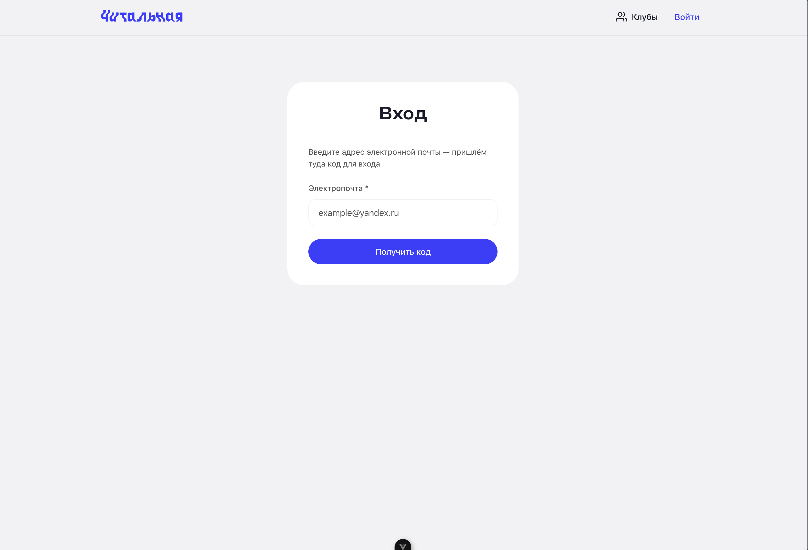
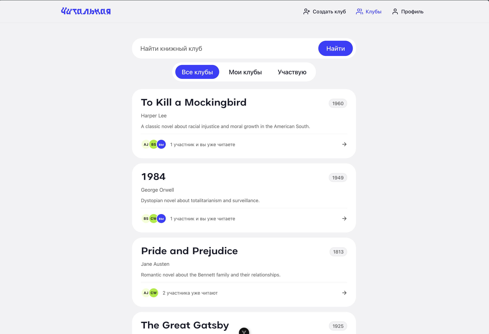
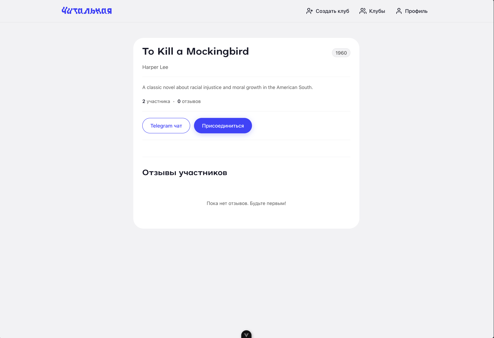
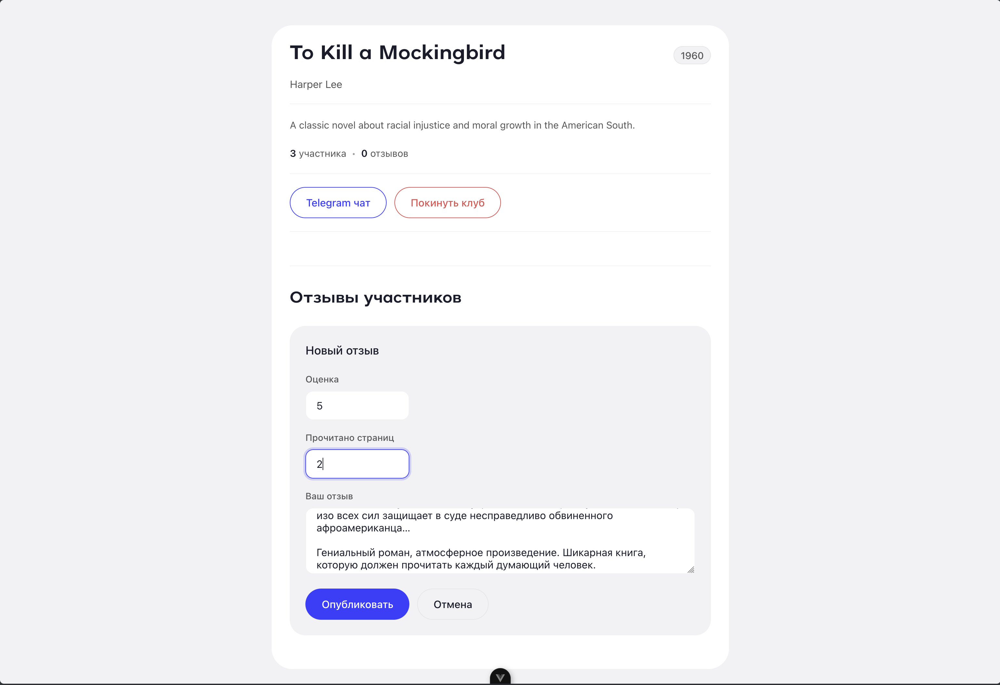
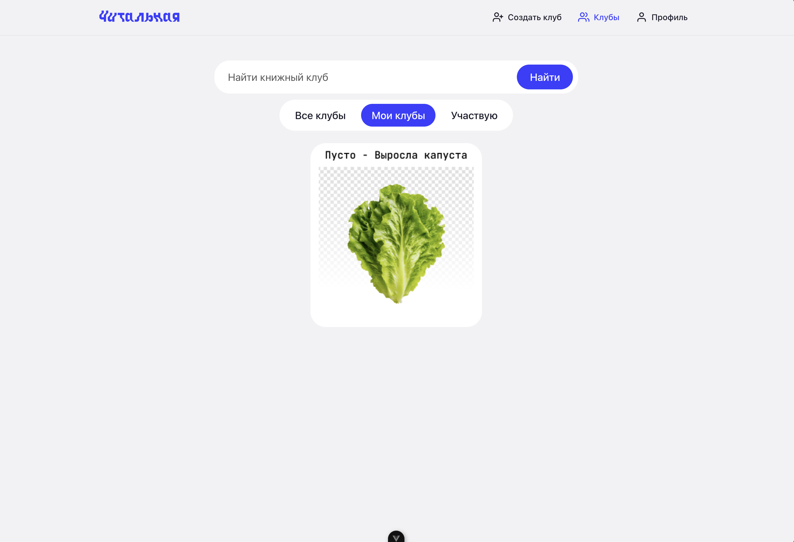

# Книжный клуб

## Запуск 

1. docker compose -f docker-compose.yml -f docker-compose.local.yml up -d backend
2. cd frontend && pnpm i && pnpm run dev
3. docker compose exec backend python manage.py loaddata users.json clubs.json

## Скриншоты

