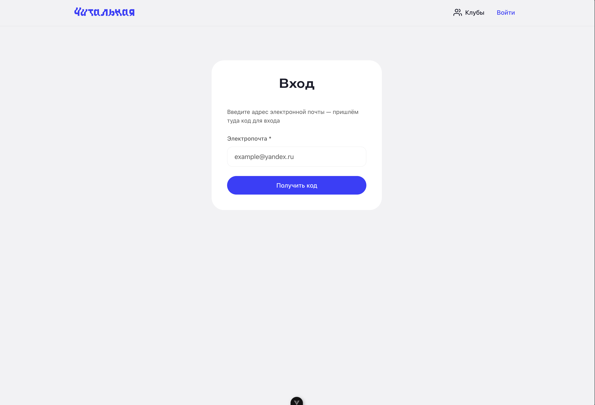
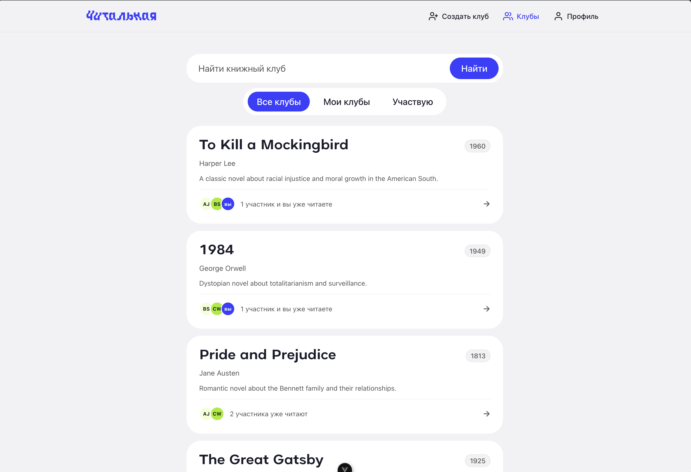
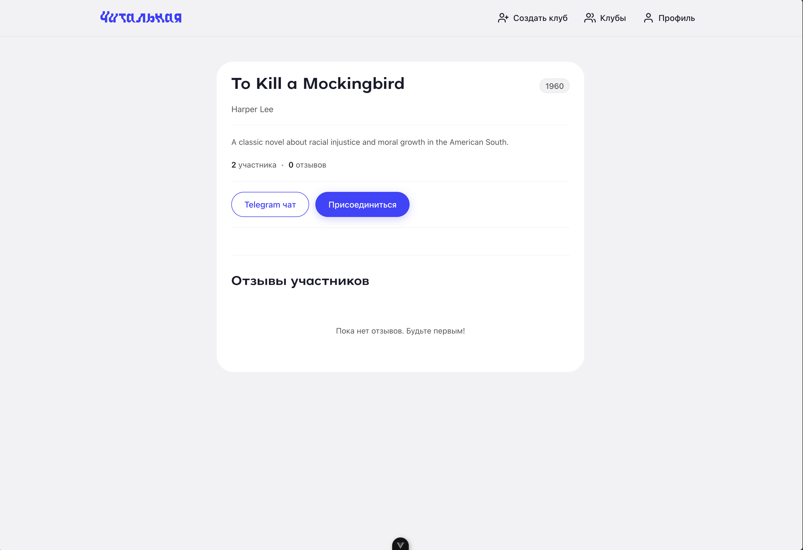
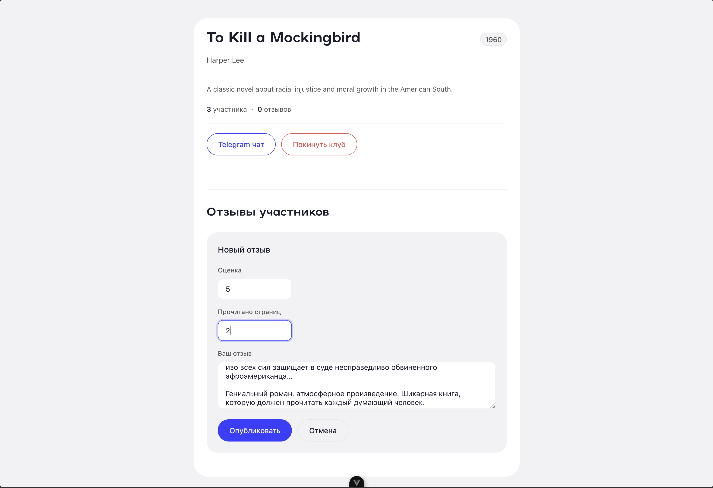
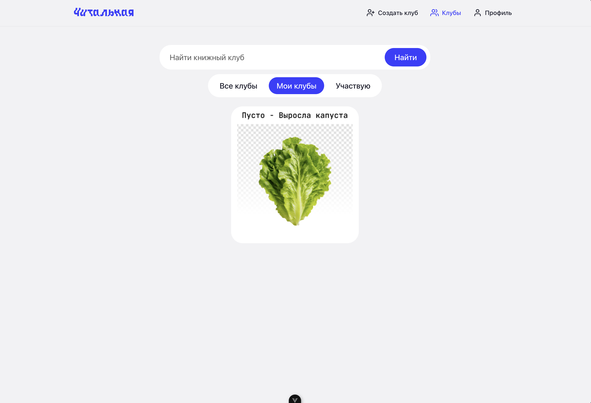

# Книжный клуб

## Запуск 

1. docker compose -f docker-compose.yml -f docker-compose.local.yml up -d --build
2. docker compose exec backend python manage.py loaddata users.json clubs.json

## Для разработки используется

1. docker compose -f docker-compose.yml -f docker-compose.local.yml up -d --build postgres mailpit 
2. cd backend && task all 
3. cd frontend && pnpm run dev 

## Скриншоты

Подумать как отображать книжные клубы авторские: 
1. Футер карточки оставляем как есть 
2. Убрать плашку "Авторский клуб" 
3. Убрать #app > div > main > div > div > div.content-grid > div > div > div:nth-child(2) > div.card-author-club > span 
4. <h3 data-v-b4f12f75="" class="card-title">Чистая архитектура &lt;2017&gt;</h3> Вот тут не название книги должно быть а имя и фамилия автора 
5. Описание должно быть таким же как сейчас +  Читают сейчас: «Чистая архитектура» (2017)  нужно сделать таким же размером как и описание и сделать отступы между ними 

Для страны авторизации удали этот текст Читальная
Место, где книги объединяют людей 

И шрифтом который используется для текста Вход напиши: 
После того как вы войдете вы сможете создавать клубы по книге и авторские клубы, присоединяться к существующим клубам, создавать страницу прочитанных вами книг 